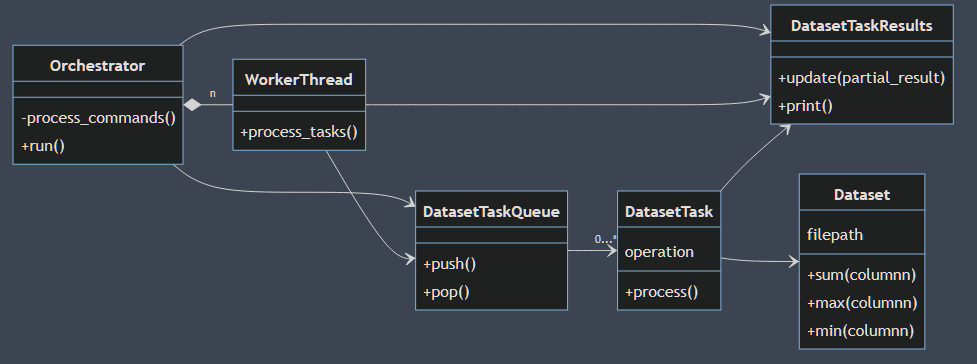
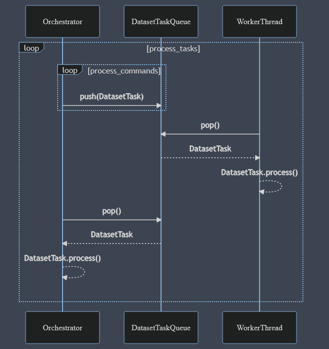

# TP2
## Taller de Programación FIUBA 2021 2C
## Manuel Reberendo 100930
<br>
<br>

# Introducción
El programa consiste en un implementación de la técnica *Split-Apply-Combine* para la resolución de diversas operaciones sobre columnas de un dataset, separando al mismo en particiones sobre las que se realizarán estas operaciones, evitando así cargarlo entero en memoria.  
Al mismo tiempo, esta implementación soporta la utilización de multiples hilos, que permitirán procesar varias particiones de forma concurrente.

# Clases
Para la resolución del problema, se implementan algunas clases, que pueden verse en el siguiente diagrama (simplificado):
  

A continuación, un resumen, métodos principales e interacciones de cada una de ellas: 

## Dataset
Representa un *dataset*, o una partición de un *dataset*.  
Guarda la ruta al archivo donde se encuentra el *dataset*, así como las filas que abarca y la cantidad de columnas que posee.  
Implementa un método público para las operaciones Suma, Máximo y Mínimo de una columna del *dataset* indicada por parámetro, así como un método para obtener la cantidad de filas que abarca. De esta forma, pueden realizarse todas las operaciones pedidas por consigna.  
Internamente, el *dataset* se lee del archivo y se carga a memoria con el método privado `load()` únicamente cuando se pide hacer una operación sobre una de sus columnas.  
A modo de ejemplo, se muestra a continuación la implementación del método `"column_sum"` que suma los valores de una columna recibida por parámetro:
```c++
long Dataset::column_sum(const long column){
    std::vector<uint16_t> buffer = this->load();
    long partial_sum = 0;
    for (size_t i = column;
         i < this->columns * (this->row_end - this->row_start);
         i += this->columns){
        uint16_t value = be16toh(buffer[i]);
        partial_sum += value;        
    }
    return partial_sum;
}
```
La implementación del resto de las operaciónes es muy similar.  
Como puede verse, con la llamada al método `load()` se carga el *dataset* en memoria dentro de un `std::vector<uint16_t>` de modo que el acceso a disco se limita únicamente a la realización de la operación requerida, y podrían crearse varias instancias de `Dataset` en simultaneo sin estár realmente cargando los datos en memoria.  
Por último, la implementación del método `load()` mencionado:
```cpp
std::vector<uint16_t> Dataset::load(){
    unsigned long bytes_to_read = sizeof(uint16_t) * 
                                  this->columns * 
                                  (this->row_end - this->row_start);        
    std::vector<uint16_t> buffer(bytes_to_read);
    std::ifstream file(this->path, std::ifstream::in);
    // Se posiciona el puntero en la fila inicial
    unsigned long start_point = this->columns * 
                                this->row_start * 
                                sizeof(uint16_t);
    file.seekg(start_point);
    file.read((char *) buffer.data(), bytes_to_read);
    return buffer;
}
```
Que como se mencionó, guarda en un `std::vector` de `<uint16_t>` (que es el típo de dato que por consigna contiene cada valor en el archivo) el *dataset* desde la fila inicial hasta la final, utilizando la ruta al archivo indicado en la creación de `Dataset`.

## DatasetTaskResults
Por consigna se pide que los resultados parciales de las tareas a realizar sobre el *dataset* de un archivo se guarden en un objeto compartido, en el que cada hilo pueda actualizar el resultado de la operación que está realizando. De esta forma, se genera una *Race Condition* que debemos resolver. Este es el rol de DatasetTaskResults.  
Internamente, no es más que un `std::map` que asocia una *operation_id*, que identifica una operación a realizar sobre el dataset (Es decir, cada una de las operaciónes que se ingresan por *stdin* al programa), con un `std::vector` en el que se almacena el resultado parcial de la operación y la cantidad de filas hasta el momento procesadas. Además existe otro `std::map` que asocia cada *operation_id* con el típo de operación que representa (`"sum","mean","max" o "min"`).  
Por último, posee un `std::mutex`, que utilizará para resolver la *Race Condition* anteriormente mencionada.  
Sus únicos métodos son `update()` que se utiliza para actualizar el resultado parcial de una operación (o agregarlo si aún no existe), y `print()` que imprime los resultados en el formato requerido por consigna.  
Se muestra a continuación la implementación de `update()`:
```cpp
void DatasetTaskResults::update(const unsigned long operation_id, 
                                const long result, 
                                const long processed_rows, 
                                std::string operation){
    std::unique_lock<std::mutex> unique_lock(this->mutex);
    //Si la operation_id ya está en el mapa, actualiza. Si no, inserta.
    if (this->results.find(operation_id) != this->results.end()){
        this->results[operation_id][1] += processed_rows;        
        if (operation == "sum" || operation == "mean"){
            this->results[operation_id][0] += result;
        } else if (operation == "max" && result > this->results[operation_id][0]){
            this->results[operation_id][0] = result;                 
        } else if (operation == "min" && result < this->results[operation_id][0]){
                this->results[operation_id][0] = result;
        }
    } else {
        std::vector<long> vector({result,processed_rows});
        this->results.insert({operation_id,vector});
        this->task_operations.insert({operation_id,operation});
    }
}
```
En donde se destaca la utilización del `std::mutex` en un `std::unique_lock` que abarcará toda la ejecuciónd el método, impidiendo de esta forma que dos hilos intenten insertar o actualizar un resultado parcial al mismo tiempo.

## DatasetTask
Representa una tarea a realizar sobre un `Dataset`, que puede o no ser una partición de un *dataset* presente en un archivo.  
Posee una referencia a una instancia de `DatasetTaskResults` en la que almacenará los resultados luego de realizarse la tarea en cuestión.  
Posee además un `Dataset` del que se encargará de crear, sobre el que se realizará la tarea definida por los atributos `operation` y `column` (Qué operacion y sobre qué colúmna).  
El método `process()` se encargará de procesar la tarea:
```cpp
void DatasetTask::process(){
    long result = 0;
    if (this->operation == "sum" || this->operation == "mean"){
        result = this->dataset.column_sum(this->column);
    }
    if (this->operation == "max"){
        result = this->dataset.column_max(this->column);
    }
    if (this->operation == "min"){
        result = this->dataset.column_min(this->column);
    }
    results.update(this->command_id, 
                   result,
                   this->dataset.row_count(),
                   this->operation);
}
```
Simplemente se encarga de obtener el resultado de la tarea sobre el `Dataset`, y luego actualizar el mismo en el objeto compartido `DatasetTaskResults` .  
## DatasetTaskQueue
Como se quiere que las tareas sobre el *dataset* puedan realizarse de forma concurrente por varios hilos, mientras un hilo principal lee de entrada estandar y las genera, debemos implementar una cola de tareas *Thread Safe* y además *Bloqueante*, pues puede pasar que el hilo principal genere las tareas a realizar con menor velocidad que lo que tardan los hilos que las realizan en procesarlas, en cuyo caso estos deben esperar hasta que haya una nueva tarea disponible.  
Internamente, `DatasetTaskQueue` hace uso de una `std::queue`, un `std::mutex` para evitar *Race Conditions* entre los hilos de forma similar a lo que ocurría con el objeto compartido `DatasetTaskResults`, y una `std::condition_variable` para resolver el problema de la espera de los hilos consumidores hasta que haya una nueva tarea disponible.  
Al mismo tiempo, es necesario tener una forma de indicar que la cola ya no recibirá más tareas (se "cerró") porque el hilo principal ya dejó de generarlas. Esto se consigue con una variable booleana `open` que por defecto es verdadera, y su correspondiente método `close()` para cerrarla.  
Los métodos que hacen uso del *mutex* con un `std::unique_lock` para evitar las race conditions son `close()`, `push()` y de `pop()` .  
A continuación se muestra la implementación de `push()` y `pop()`:  
```cpp
void DatasetTaskQueue::push(DatasetTask task){
    std::unique_lock<std::mutex> unique_lock(this->mutex);    
    this->queue.push(task);
    this->condition_variable.notify_all();    
} 
DatasetTask DatasetTaskQueue::pop(){
    std::unique_lock<std::mutex> unique_lock(this->mutex);
    while (this->queue.empty()){        
        if (!this->open){
            throw -1;
        }
        this->condition_variable.wait(unique_lock);
    }
    DatasetTask task = std::move(this->queue.front());
    this->queue.pop();        
    return task;
} 
```
Donde se destaca cómo la *condition_variable* en `push()` se utiliza para notificar a todos los hilos que se agregó una tarea a la cola, mientras que en su contraparte `pop()` se utiliza para esperar a que haya una nueva tarea disponible.  
Además, debe verificarse al hacer `pop()` que la cola no esté vacía y además cerrada, ya que esto indicaría que se terminaron de procesar todas las tareas. En ese caso se lanza una excepción, y los hilos consumidores la atraparán para finalizar el procesamiento.

## WorkerThread
Representa un hilo cuya finalidad es la de procesar las tareas de la cola de tareas hasta que estas se acaben y la cola se cierre.  
La cantidad de instancias de esta clase estará determinada por parámetro al momento de ejecutar el programa.  
Al momento de construirse, se lanza un `std::thread` que ejecuta la función `process_tasks()`:
```cpp
void WorkerThread::process_tasks(){
    while (true){        
        try {
            this->tasks_queue.pop().process();
        } catch(...){
            break;
        }        
    }
}
```
Que simplemente desencola tareas de la cola bloqueante de tareas y las procesa. Cuando la cola de tareas esté vacia y cerrada, lanzará una excepción y el bucle terminará.

## Orchestrator
Se encarga de "orquestrar" la ejecución del programa, es decir:
- Crear los `WorkerThread` indicados por parámetro.
- Procesar los comandos recibidos por entrada estandar y crear las tareas correspondientes a ellos.
- "Ayudar" a los hilos worker a terminar de procesar las tareas restantes cuando ya no hay más comandos que recibir.
- Esperar (*Joinear*) a que los hilos worker terminen de procesar sus tareas.
- Imprimir los resultados

Para esto, posee un `std::vector` de `WorkerThread`, la cola de tareas y el objeto compartido de resultados.  
El siguiente diagrama intenta ilustrar el bucle principal de generación y procesamiento de tareas que maneja el `Orchestrator`:
  
  
Una de sus funciones más importantes, `Orchestrator::process_commands()`:
```cpp
void Orchestrator::process_commands(){    
    long command_id = 0;
    for (std::string line; std::getline(std::cin, line);) {                
        unsigned long start_row, end_row, partition_size, column;
        std::string operation;
        std::tie(start_row, end_row, 
                 partition_size, column, 
                 operation) = this->parse_command(line);        
        this->add_task(start_row, end_row, 
                       partition_size, column, 
                       operation, command_id);        
        command_id ++;
    }    
    this->tasks_queue.close();  
}
```
es la encargada de recibir por `std::cin` los comandos con las tareas a realizar, parsearlos para obtener cada uno de sus parámetros, y luego crear una tarea a partir de ellos para finalmente agregarla a la cola.  
Y para finalizar, la función principal de la clase, `Orchestrator::run()`, con el desarrollo ordenado del programa que se comentó anteriormente, esta vez de forma explicita:
```cpp
void Orchestrator::run(){    
    this->process_commands();
    this->process_remaining_tasks();
    this->join_workers();
    this->print_results();
}
```


